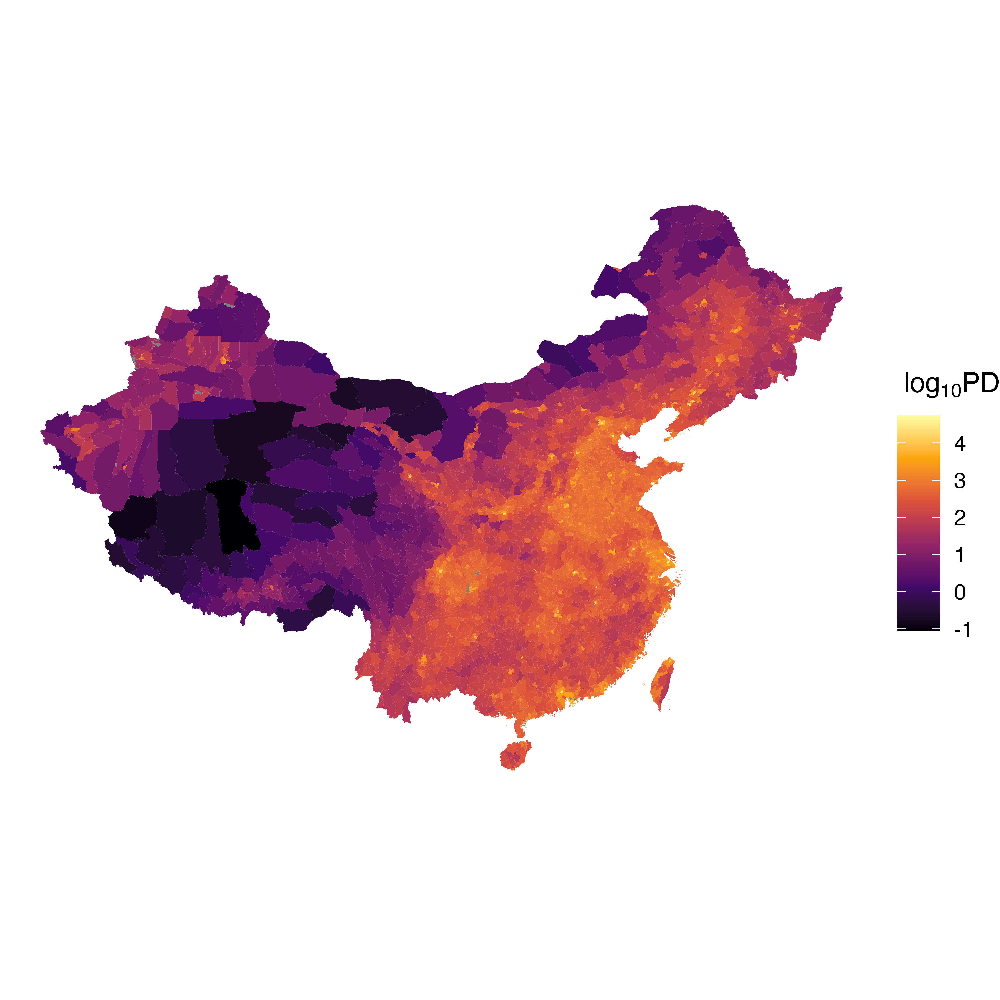
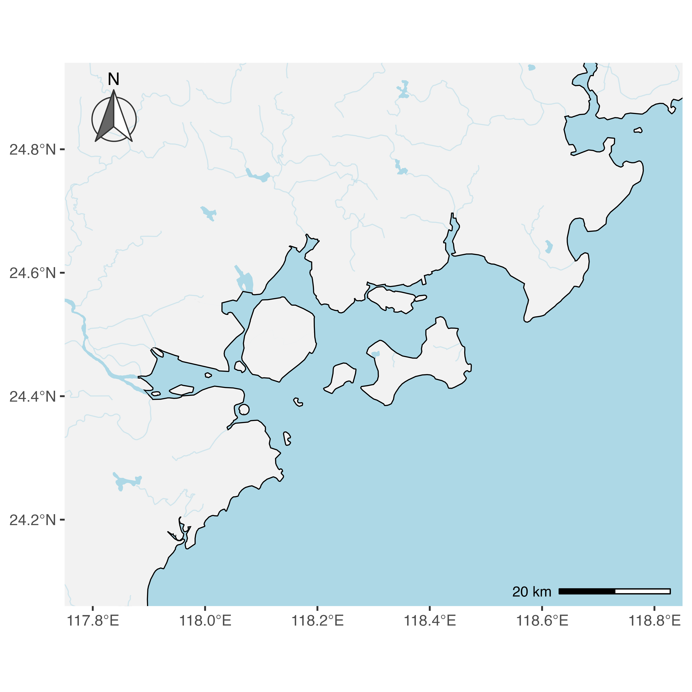

layout: true
  
<div class="my-footer"><span>Qiao-Guo Tan/CEE/XMU | tanqg@xmu.edu.cn | 2025-Mar-27   
&emsp;&emsp;&emsp;&emsp;&emsp;&emsp;&emsp;&emsp;&emsp;&emsp;&emsp;&emsp;&emsp;
&emsp;&emsp;&emsp;&emsp;&emsp;&emsp;&emsp;&emsp;&emsp;&emsp;&emsp;&emsp;&emsp;
</span></div> 

---
## 本课件中用到的packages  

package       |功能
--------------|---------------------
`tidyverse`   |全球陆地地图，转化数据、作图
`sf`          |读取shp底图文件
`mapchina`    |中国底图文件
`marmap`      |全球海洋深度数据
`ggspatial`   |添加指北针、比例尺
`patchwork`   |拼图（显示南海诸岛）
`readxl`      |读取excel文件
`ggrepel`     |添加文字，自动防止文字重叠


---
## 本课件中用到的数据  

下载地址：https://pan.baidu.com/s/1zNh1btCIfoETKjdHDkv31w?pwd=qqgv  

---
class: inverse, middle, center
#  1. 全球、大洋尺度地图  
#  2. 中国行政区划地图  
#  3. 中国海岸带地图  


---

## 1. `ggplot2`自带全球陆地底图  

```{r message=FALSE, warning=FALSE}
library(tidyverse)

```

- 优点：不依赖其他程序包，储存了各国国界，运行快速
- 缺点：中国国界不准确，没有显示南海诸岛...  

--

### 读取世界地图  

```{r}
d_wd_map <- map_data("world") 
```

---

## 1.1 `tidyverse`自带全球陆地底图 

###  查看储存了哪些信息  

```{r}
names(d_wd_map)
```

* 地图由多个多边形组成   
* 每个多边形由一组点连接而成  
* 点的位置由经纬度（`long`, `lat`）确定  
* 点的分组用`group`标识  

---

## 绘制世界地图  

```r
ggplot(d_wd_map, aes(long, lat, group = group))+
  theme_bw()+
  geom_polygon()
```

--
```{r echo=FALSE, out.width=805/1.1, out.height=405/1.1}
# ggsave("figs/p_global_1.png", width = 805/90, height = 405/90, dpi = 900)

```


---
## 运用该地图，绘制世界各国森林面积变化图  

*  1990-2015年，世界各国森林面积的变化数据    
```{r}
d_forest_0 <- read.csv("data/forest.csv") 
head(d_forest_0)
```

数据来源：https://github.com/rfordatascience/tidytuesday/blob/master/data/2021/2021-04-06/readme.md

---
## 1990-2015年世界各国森林面积变化  
* 计算1990-2015年森林面积的累计变化  

```{r}
d_forest <- d_forest_0 |> 
  group_by(entity) |> 
  summarise(net_forest_conversion = sum(net_forest_conversion))
```

* 两套数据中美国的名称不一致，修改后方能合并
```{r}
d_forest$entity <- gsub("United States", "USA", d_forest$entity)
```

---
## 1990-2015年世界各国森林面积变化

* 用`left_join()`将森林数据和地图数据合并
* 注意森林数据中国家列名为`entity`，地图数据中国家列名为`region`  

```r
map_data("world") |>  
  left_join(d_forest, 
            by = c("region" = "entity")) |>  
  ggplot(aes(long, lat, group = group,
             fill=net_forest_conversion))+
  geom_polygon()
  
```
---
## 1990-2015年世界各国森林面积变化

```{r echo=FALSE, out.width=805*1.2, out.height=405*1.2}
# ggsave("figs/p_forest_1.png", width = 805/90, height = 405/90, dpi = 900)

```

---
## 修饰细节  

配色网站：https://colorbrewer2.org/  

```r
#自定义配色
pal_GrBr <- c("#543005","#8c510a","#bf812d","#dfc27d","#f6e8c3",
           "#c7eae5","#80cdc1","#35978f","#01665e","#003c30")

map_data("world") |>  
  left_join(d_forest, 
            by = c("region" = "entity")) |>  
  ggplot(aes(long, lat, group = group,
             fill=net_forest_conversion/1e6))+
  geom_polygon(color="black", size=0.1)+
  coord_sf()+
  scale_fill_gradientn(colours = pal_GrBr, na.value="white",
                       breaks=seq(-10,10,5))+
  labs(x="Longitude",
       y="Latitude",
       fill=~"Net forest \nconversion ("*10^6~"ha)")
```
---
## 1990-2015年世界各国森林面积变化
```{r echo=FALSE, out.width=805*1.2, out.height=405*1.2}
# ggsave("figs/p_forest_2.png", width = 805/90, height = 405/90, dpi = 900)

```

???

## 其他投影方式  

- 默认采用墨卡托（mercator）投影  
- 可采用多种其他投影
  * `?coord_map`查看其他投影方式  
常用投影参考：https://ggplot2.tidyverse.org/reference/coord_map.html

### **gilbert**投影 

```r
library(mapproj)
ggplot() +
  theme_bw() +
  geom_polygon(data=d_wd_map, aes(long, lat, group=group),
               fill="grey50",colour = "black",size=0.1)+
 coord_sf(projection="gilbert", xlim=c(-180,180))
```


```{r echo=FALSE, out.width=500/1.1, out.height=415/1.1}

```


---
## 1.2 从NaturalEarth网站下载全球、大洋尺度地图  

* 网址：http://www.naturalearthdata.com/downloads/  
* 有不同分辨率、不同物理属性的底图可供选择。此处选择了分辨率为1:110m的底图：Land polygons including major islands. Download land (68.07 KB) version 4.0.0。  

  
---
## `sf`程序包

```{r message=F, warning=F}
library(sf)  
```

* `sf`程序包：用于读取shp底图文件  
* 介绍： https://r-spatial.github.io/sf/
---

## 获取全球陆地底图  


- **读取`shp`文件** 
```{r message = F}
d_wd_land <- st_read("maps/ne_110m_land/ne_110m_land.shp")
```
---

## 获取全球陆地底图  

- **查看数据**  
```{r}
head(d_wd_land) 
``` 

---

## 绘制全球陆地地图  

```r
d_wd_land |>
  ggplot() +
  theme_bw() +
  geom_sf()
```
--

```{r echo=FALSE, out.width=718/1.2, out.height=446/1.2}
# ggsave("figs/p_nearth_1.png", width = 718/90, height = 446/90, dpi = 900)

```

---
## 海洋深度数据：用`marmap`程序包获取  

```{r message=F, warning=FALSE}
library(marmap) #install.packages("marmap")
```

- 用`getNOAA.bathy()`函数从NOAA网站获取海水深度数据；  
- 获取数据时，需指定经纬度范围以及分辨率`resolution`；    
- 此处我们获取全球海水深度数据；  
- 分辨率单位是minute，默认分辨率是4 minutes，此处为了节省下载时间，设置为较粗糙的30 minutes。

```r
Bathy <- getNOAA.bathy(lon1 = -180, lon2 = 180, lat1 = -90, lat2 = 90, resolution = 30)

Bathy_df <- fortify.bathy(Bathy)

```

---
## 海洋深度数据：用`marmap`程序包获取 

- 数据下载需要几分钟时间，为节省时间，可将数据保存在本地备用，以免每次下载。  

```r
write.csv(Bathy_df, "Bathy_df_global.csv")

Bathy_df <- read.csv("data/Bathy_df_global.csv")

```

---

## 添加海水深度图层

```r
ggplot() +
  theme_bw() +
  geom_sf(data = d_wd_land) +
  geom_raster(data=Bathy_df[Bathy_df$z<=0,], #筛选深度小于等于0的数据
              aes(x, y, fill=z))
```

- 注意：原始数据包括陆地，深度为正数  
- 为获得海水深度数据，筛选数据，仅保留深度小于等于0的数据  

---

## 添加海水深度图层

```{r echo=FALSE, out.width=718, out.height=446}
# ggsave("figs/p_bathy.png", width = 718/90, height = 446/90, dpi = 900)

```

---

## 修饰细节 

```r
ggplot() +
  theme_bw() +
  geom_sf(data = d_wd_land, fill = "grey50", colour = "black", size = 0.1) +
  geom_raster(data = Bathy_df[Bathy_df$z <= 0, ],
              aes(x, y, fill = z)) +
  scale_x_continuous(breaks = seq(-180, 180, 60), expand = c(0, 0)) +
  scale_y_continuous(breaks = seq(-90, 90, 30), 
                     limits = c(-90, 90), expand = c(0, 0)) +
  scale_fill_distiller(palette = "Blues", na.value = "white") +
  labs(x = "Longitude", y = "Latitude", fill = "Depth (m)")
  
```

- `scale_fill_distiller`：更改配色方案，此处使用渐变`Blues`配色  


---

## 全球陆地+海洋深度地图

```{r echo=FALSE, out.width=718, out.height=446}
# ggsave("figs/p_bathy_2.png", width = 718/90, height = 446/90, dpi = 900)

```

---

## 1.3 蚂蚁地理空间数据可视化平台  

* 下载中国版本的世界地图：  https://l7.antv.antgroup.com/custom/tools/worldmap  
* 已下载，保存为文件：`worldmap_antgroup.geojson`   
* 优点：国界线正确  

```r
d_ag <- st_read("maps/worldmap_antgroup.geojson") 
d_ag %>% 
  ggplot()+
  theme_classic()+
  geom_sf()+
  geom_sf(data = dplyr::filter(d_ag, NAME_CHN == "中国"), fill = "gold2")

```

---

## 1.3 蚂蚁地理空间数据可视化平台  

```{r echo=FALSE, out.width=718, out.height=446}
# ggsave("figs/p_antgroup_wd_map.png", width = 718/90, height = 446/90, dpi = 900)

```


---
## 2.中国行政区划地图  

### 2.1 用阿里云（高德地图）数据作为底图   
* 优点：可确保地图是最新版的
* 缺点：海岸带分辨率不高，不宜用于绘制局部（如九龙江口）的精细地图

* 阿里云数据可视化平台：
http://datav.aliyun.com/portal/school/atlas/area_selector  

* 点击选择区域，可选择全国，也可选择省或者市
* 点选后，“JSON API”框内会生成相应地址，复制代码，用以下方式读取

---

###  从阿里云读取中国地图数据   

```r
library(sf) #读取数据
library(ggspatial) # 添加指北针、比例尺

d_china <- st_read('https://geo.datav.aliyun.com/areas_v3/bound/100000_full.json')[c('adcode','name','geometry')]

```

---

### 中国地图   

.pull-left[
```r
p_china <- d_china |> 
  ggplot() +
  geom_sf() +
  annotation_scale(height = unit(0.1, "cm")) +  #比例尺
  annotation_north_arrow(location = "tl", style = north_arrow_fancy_orienteering(fill = c("grey40","white"), line_col = "grey20")) #指北针

p_china
```
]


.pull-right[
```{r echo=FALSE, out.width=500/1.2, out.height=500/1.2}
# ggsave("figs/p_china_1.png", width = 500/90, height = 500/90, dpi = 900)

```
]


---

### 中国地图 (未显示南海诸岛)   

.pull-left[
```r
p1 <- p_china + 
  coord_sf(ylim = c(18, NA)) +
  theme_bw()

```
]

.pull-right[
```{r echo=FALSE, out.width=500/1.2, out.height=500/1.2}
# ggsave("figs/p_china_2.png", width = 500/90, height = 500/90, dpi = 900)

```
]


---

## 南海诸岛

.pull-left[
```r
p_nanhai <- d_china |> 
  ggplot()+
  theme_void()+
  geom_sf(fill = "transparent")+
  coord_sf(xlim=c(105,123), ylim=c(3,25), expand=F)+
  theme(panel.background = element_rect(color="black"))
  
```
]


.pull_right[
```{r echo=FALSE, out.width=500/1.2, out.height=500/1.2}
# ggsave("figs/p_nanhai.png", width = 500/90, height = 500/90, dpi = 900)

```
]

---

### 中国地图 (南海诸岛单独显示)  

```r
library(patchwork)

p1 + inset_element(p_nanhai, left = 0.8, bottom = 0, right = 1, top = 0.35)
```


```{r echo=FALSE, out.width=500, out.height=500}
# ggsave("figs/p_china_4.png", width = 500/90, height = 500/90, dpi = 900)

```

---

### 福建省地图  

* 在阿里云平台选择福建，获取网址，下载数据  

```r
d_fj <- st_read('https://geo.datav.aliyun.com/areas_v3/bound/350000_full.json')[c('adcode','name','geometry')]
```


```r
d_fj |> 
  ggplot()+
  geom_sf()+
  annotation_scale(height = unit(0.1, "cm"), location="br")+
  annotation_north_arrow(location="tl",
                         style = north_arrow_fancy_orienteering(
                           fill = c("grey40","white"),
                           line_col = "grey20"))

```
---
### 福建省地图  

```{r echo=FALSE, out.width=500/1.2, out.height=500/1.2}
# ggsave("figs/p_china_5.png", width = 500/90, height = 500/90, dpi = 900)

```


---

## 全国各市空气质量地图

* 读取空气质量指数数据：  
```{r message=F, warning=F}
library(readxl)
d_AQI<- read_excel("data/20210406AQI.xlsx")

names(d_AQI)

sample(unique(d_AQI$City), 10)
```

数据来源：http://www.pm25.in/rank  

---

## 全国各市空气质量地图

* 读取全国市级地图： 
```{r message=F, warning=F}
d_china_city <- st_read("maps/aliyun/china_city_aliyun.shp" )
names(d_china_city)
```

该地图从`amapr`程序包从阿里云平台读取保存

---

## 全国各市空气质量地图

```r
pal_GrBr <- c("#543005","#8c510a","#bf812d","#dfc27d","#f6e8c3",
           "#c7eae5","#80cdc1","#35978f","#01665e","#003c30")
breaks <- c(20, 50, 100, 150, 200, 300, 400, 500)
d_china_city$nam_cty <- gsub("市", "", d_china_city$nam_cty) #空气质量数据中没有“市”字，故需删去地图数据中的“市”字，以便合并
d_china_city |>  
  left_join(d_AQI, by = c("nam_cty" = "City")) |>  
  ggplot() +
  geom_sf(aes(fill = log10(AQI)), color = "grey30", size = 0.1) +
  theme_bw() +
  scale_fill_gradientn(trans = "log", labels = breaks, 
  breaks = log10(breaks), colors=rev(pal_GrBr), na.value = "white") +
  labs(fill = "AQI")
```

---
## 全国各市空气质量地图

```{r echo=FALSE, out.width=500*1.2, out.height=500*1.2}
# ggsave("figs/p_china_air.png", width = 500/90, height = 500/90, dpi = 900)

```


---
## 用`mapchina`程序包绘制中国地图  

* 优点：数据量小，出图快速
* 缺点：缺南海诸岛（可以自己补），数据更新可能不及时


* `mapchina`程序包介绍：
https://github.com/xmc811/mapchina

---
## 用`mapchina`程序包绘制中国地图  

```{r}
library(mapchina)
library(sf)
names(mapchina::china) #查看储存了哪些信息
```

变量            | 信息
----------------|---------------
Code_County     | 县级行政区代码     
Code_Perfecture | 地级行政区代码 
Code_Province   | 省级行政区代码 
Name_Province   | 省级行政区名称
Name_Perfecture | 地级行政区名称
Name_County     | 县级行政区名称

---

### 全国人口密度图

.pull-left[
```{r}
p_cnpop <- mapchina::china |> 
  ggplot(aes(fill = log10(Pop_2010/Area))) +
  theme_void()+
  geom_sf(color = "transparent")+
  #geom_sf(size = 0, color="black")+
  scale_fill_viridis_c(option = "B")+
  #scico::scale_fill_scico(palette = "batlow")+
  labs(fill = ~log[10]*"PD") # ind/km2

```
]


.pull-right[

```{r echo=FALSE, out.width=500, out.height=500}
# ggsave("figs/p_china_pop.png", width = 500/90, height = 500/90, dpi = 900)

```
]

---

### 全国人口密度（显示南海诸岛）
```r
p_cnpop + inset_element(p_nanhai, left = 0.8, bottom = 0.1, right = 1, top = 0.35)
```

```{r echo=FALSE, out.width=500, out.height=500}
# ggsave("figs/p_china_pop_2.png", width = 500/90, height = 500/90, dpi = 900)

```


---

### 分省绘图  

* 使用`st_union()`函数合并省份`geometry`    

```{r message=FALSE, warning=FALSE}
sf_use_s2(FALSE)

d_map_china <- mapchina::china |> 
  group_by(Name_Province) |> 
  summarise(geometry = st_union(geometry),
            pop = sum(Pop_2010, na.rm = T),
            area = sum(Area, na.rm = T))   # 若报错，运行sf_use_s2(FALSE)
```


```r
d_map_china |>   
ggplot(aes(fill = log10(pop/area))) +
  geom_sf()+
  scale_fill_viridis_c(option = "B")
```

---

### 分省绘图  

```{r echo=FALSE, out.width=500, out.height=500}
# ggsave("figs/p_china_pop_3.png", width = 500/90, height = 500/90, dpi = 900)

```


---

### 选择福建省，分地级市绘图  

```{r message=FALSE, warning=FALSE}
d_map_fj <- china %>%
        filter(Name_Province == "福建省") |> 
        group_by(Code_Perfecture) %>%
        summarise(geometry = st_union(geometry),
                  pop = sum(Pop_2010, na.rm = T),
                  area = sum(Area, na.rm = T))  # 若报错，运行sf_use_s2(FALSE)
```


```r
d_map_fj |>   
ggplot(aes(fill = pop/area)) +
  theme_minimal()+
  geom_sf()+
  scale_fill_viridis_c(option = "A", begin = 0.3, end = 0.9)+
  labs(fill = ~"PD (km"^"-2"*")") 

```

---
### 选择福建省，分地级市绘图   

```{r echo=FALSE, out.width=500, out.height=500}
# ggsave("figs/p_china_pop_4.png", width = 500/90, height = 500/90, dpi = 900)

```

---

## 在中国地图上显示福建位置   

.pull-left[
```r
d_map_china |> 
  ggplot()+
  theme_void()+
  geom_sf()+
  geom_sf(data = filter(d_map_china, Name_Province == "福建省"), 
          fill ="red2")
```
]


.pull-right[
```{r echo=FALSE, out.width=500/1.2, out.height=500/1.2}
# ggsave("figs/p_china_fj.png", width = 500/90, height = 500/90, dpi = 900)

```
]


---
class: inverse, middle, center

# 画地图是件严肃的事情，不能缺失领土   

---
class:  bottom, right

background-image: url("figs/incorrect_map.jpg")
background-position: center
background-size: contain


.black[快速识别“问题地图”.自然资源部网站.2019-08-02.]  

http://www.mnr.gov.cn/dt/ywbb/201908/t20190802_2451218.html


---
## 3.中国海岸带地图  


### 从国家基础地理信息中心下载底图   
* 将全国分成多个网格，选择所需网格，点选后，下载最新版本底图（例如，福建在G50网格）  
* 底图文件是gdbtable格式，分成水系、岛屿、海洋等多个图层  
 - 可用`sf::st_read()`分别读取  
 
文件名        |图层
--------------|---------------------
`a0000000e`   | `BOUA` 行政边界面
`a0000000f`   | `BOUL` 行政边界线
`a0000000a`   | `HYDA` 水系面
`a00000019`   | `HYDL` 水系线

* 网址：https://www.webmap.cn/mapDataAction.do?method=forw&resType=5&storeId=2&storeName=%E5%9B%BD%E5%AE%B6%E5%9F%BA%E7%A1%80%E5%9C%B0%E7%90%86%E4%BF%A1%E6%81%AF%E4%B8%AD%E5%BF%83  
* 注册后免费下载  


    
???
http://www.webmap.cn/commres.do?method=result100W

???
# 各图层对应表

07 = 山，点
09 = 山，点
10  = 山
11 = 保护区,面
12 = 保护区,线
13 = 保护区,点
14 = 网格线
15 = 空
16 = 填海？
17 = 河堤
18 = x点
19 = 水系
20 = 新填海？
21= 空
22 = 寺庙、塔
23 = 等高
24 = 洞
25 = ?
26 = 空
27 = 等高

0a  = 海湖河
0b = 高铁站
0c = 铁路
0d = 村镇
0e = 区县面
0f = 区县线

1a = 温泉
1b = 隧道、桥
1c = 道路
1d = 空
1e = ？建成区
1f = 点


2020年中华人民共和国行政区划代码  
http://www.mca.gov.cn/article/sj/xzqh/2020/


数据集名称	数据集类型	名称含义	主要内容
AANP	点	自然地名	交通要素名、纪念地和古迹名、山名、水系名、海洋地域名、自然地域名、境界标志名等
AGNP	点	居民地地名	各级行政地名和城乡居民地名称等
BOUA	面	行政境界	各级行政区
BOUL	线	行政境界	各级境界线
BOUP	点	界桩、碑	
BRGA	面	区域界线	自然文化区、特殊地区、开发区、保税区
BRGL	线	自然文化区、特殊地区、开发区、保税区的区界	
BRGP	点	区界不明确的自然文化区、特殊地区、开发区、保税区	
CPTL	线	坐标网	图廓线、坐标网
CPTP	点	测量控制点	测量控制点
HFCA	面	水系附属设施	干出滩、滩涂、危险区、礁石等
HFCL	线	干出线、潮水沟、高水界、流向、堤、闸、坝等	
HFCP	点	地下河段出入口、涵洞、礁石、闸、坝等	
HYDA	面	水系要素	湖泊、水库、双线的河流和沟渠等
HYDL	线	单线的河流、沟渠、河流结构线等	
HYDP	点	泉、井等	
LFCL	线	交通附属设施	车行桥、人行桥、隧道、码头、渡口等
LFCP	点	车站、公路标志、助航标志、机场等	
LRDL	线	公路	国道、省道、县道、乡道、专用公路、其它公路、街道、乡村道路等
LRRL	线	铁路	标准轨铁路、窄轨铁路、地铁、轻轨等
PIPP	点	管线与设施	变电站等
RESA	面	居民地	街区、高层建筑区、空地等
RESP	点	房屋、棚房、窑洞、蒙古包、放牧点等	
RFCA	面	居民地附属设施	工矿、农业、公共服务等
RFCL	线	工矿、城墙、垣栅等	
RFCP	点	工矿、农业、公共服务、名胜古迹、宗教设施、科学观测站等	
TERA	面	地貌与土质	沙地、冰雪地、地质灾害地貌等
TERP	点	高程注记点、峰、柱、漏斗等	
VEGA	面	植被	耕地、园地、林地、草地、城市绿地等
VEGP	点	零星树木、独立树等


---

## 行政边界  


```{r}
d_land <- st_read("maps/G50.gdb/a0000000e.gdbtable") |> 
  filter(!is.na(NAME)) #行政边界，筛选出陆地
```


---

## 行政边界  

.pull-left[
```r
d_land |> 
  ggplot()+
  geom_sf(fill="grey")
```
]

.pull_right[
```{r echo=FALSE, out.width=500, out.height=500}
# ggsave("figs/p_coast_1.png", width = 500/90, height = 500/90, dpi = 900)

```
]

---

## 海洋  


```{r}
d_sea <- st_read("maps/G50.gdb/a0000000a.gdbtable")
```

---

## 海洋  
.pull-left[
```r
d_sea |> 
  ggplot()+
  geom_sf(fill="lightblue") #岛屿也被当成海了
```
]


.pull-right[
```{r echo=FALSE, out.width=500, out.height=500}
# ggsave("figs/p_coast_3.png", width = 500/90, height = 500/90, dpi = 900)

```
]


---

## 湖泊水库  

```{r}
d_lake <- st_read("maps/G50.gdb/a0000000a.gdbtable") |> 
  filter(!is.na(NAME)) # 筛选出湖库数据
```


---

## 湖泊水库 

.pull-left[
```r
d_lake |> 
  ggplot()+
  geom_sf(fill="lightblue")
```
]

.pull-right[
```{r echo=FALSE, out.width=500, out.height=500}
# ggsave("figs/p_coast_2.png", width = 500/90, height = 500/90, dpi = 900)

```
]

---

## 河流  

```{r}
d_river <- st_read("maps/G50.gdb/a00000019.gdbtable") |> 
  filter(!is.na(NAME)) #有名字的才是河
```

---

## 河流  

.pull-left[
```r
d_river |> 
  ggplot()+
  geom_sf(color = "lightblue")
```
]

--

.pull-right[
```{r echo=FALSE, out.width=500, out.height=500}
# ggsave("figs/p_coast_4.png", width = 500/90, height = 500/90, dpi = 900)

```
]


---

## 合并以上图层  

.pull-left[
```r
ggplot()+
  geom_sf(data = d_sea, fill = "lightblue", color = "black", linewidth = 0.6)+ #海 
  geom_sf(data = d_land, color = "transparent", fill = "grey95") + #陆地 
  geom_sf(data = d_lake, fill="lightblue", color = "lightblue") + #湖 
  geom_sf(data = d_river, color="lightblue",linewidth = 0.3, alpha = 0.5)  #河流  

```
]

--

.pull-right[

```{r echo=FALSE, out.width=500, out.height=500}
# ggsave("figs/p_coast_all.png", width = 500/90, height = 500/90, dpi = 900)

```
]


---

## 厦门周边海域采样地图  


## 绘制底层  

```r
p_xiamen  <- ggplot()+
  geom_sf(data = d_sea, fill = "lightblue", color = "black", linewidth = 0.6)+ #海 
  geom_sf(data = d_land, color = "transparent", fill = "grey95") + #陆地 
  geom_sf(data = d_lake, fill="lightblue", color = "lightblue") + #湖 
  geom_sf(data = d_river, color="lightblue",linewidth = 0.3, alpha = 0.5) + #河流  
  coord_sf(xlim = c(117.8, 118.8), ylim = c(24.1, 24.9))+   #范围
  annotation_scale(height = unit(0.1, "cm"), location = "br")+  # 比例尺
  annotation_north_arrow(location="tl",style = north_arrow_fancy_orienteering(
                             fill = c("grey40","white"),
                             line_col = "grey20")) # 指北针

```
---

## 厦门周边海域采样地图  


- **绘制底图**  

```{r echo=FALSE, out.width=500, out.height=500}
# ggsave("figs/p_xiamen_1.png", width = 500/90, height = 500/90, dpi = 900)

```


---

## 厦门周边海域采样地图  

- **读取采样站位信息**
```{r}
d_site <- read.csv("data/sample_site.csv")
head(d_site)
```

---
### 添加采样站位


```{r}
library(ggrepel) #防止文字重叠
```


```r
p_xiamen +
  geom_point(data=d_site, aes(long, lat), inherit.aes = F,
             shape=21, size=2.5, fill="tomato")+
  geom_text_repel(data=d_site, aes(long, lat, label=Site))+
  labs(x="Longitude", y="Latitude")
```


---
### 添加采样站位

```{r echo=FALSE, out.width=500, out.height=500}

# ggsave("figs/p_xiamen_2.png", width = 500/90, height = 500/90, dpi = 900)

```


---
## 要点小结  
* 从哪里获取底图：
 - 程序包（`tidyverse`, `rnaturalearth`, `mapchina`）
 - 网站：naturalearth，阿里云，国家基础地理信息中心

* `geom_polygon()` 运用`lon`, `lat`坐标数据，绘制多边形
* `sf::geom_sf()` 运用`geometry`包含信息直接绘制地图
* `sf::st_read()` 读取".gdbtable"，".shp"文件
* `sf::st_write()` 保存".shp"文件（同时生成4个文件，缺一不可）
* `sf::st_union()` 合并`geometry`    
* `ggspatial`程序包添加指北针、比例尺  
 
 


---

## 延伸阅读：

- ### Chapter 6 Maps from "ggplot2: Elegant Graphics for Data Analysis"  
https://ggplot2-book.org/maps.html

- `rnaturalearth`下载底图数据
https://cran.r-project.org/web/packages/rnaturalearth/index.html

- `maps`程序包  
https://cran.r-project.org/web/packages/maps/maps.pdf

- `ggOceanMaps`绘制海洋地图   
https://mikkovihtakari.github.io/ggOceanMaps/

- 如何设置不同投影方式    
https://wilkelab.org/practicalgg/articles/Winkel_tripel.html

